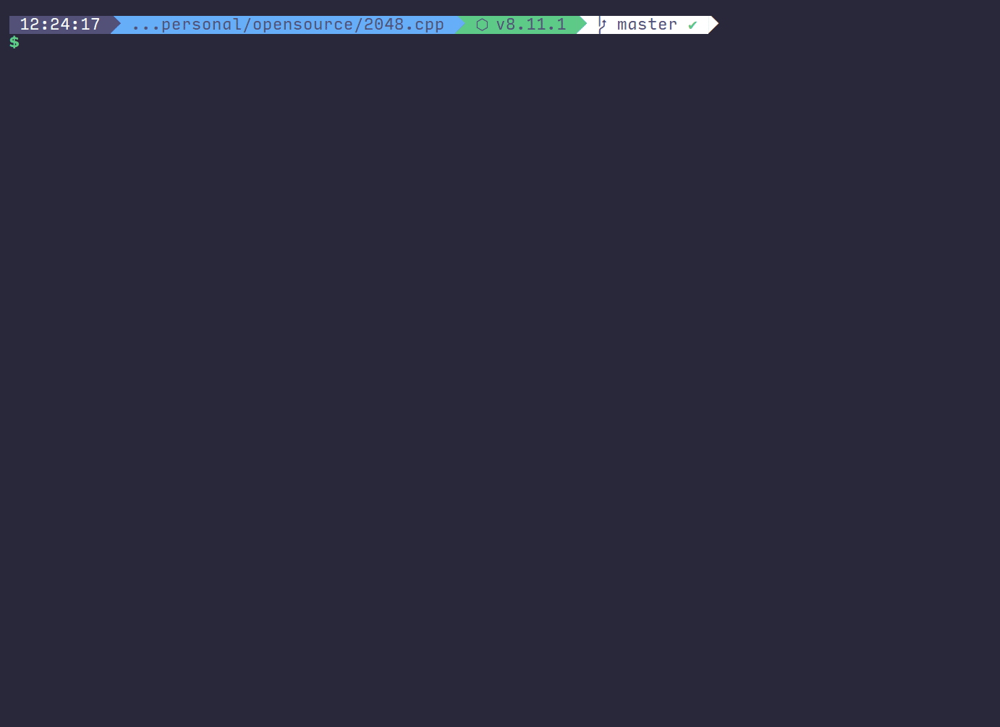

# 2048.swift

> This is a Swift version of [2048.cpp](https://github.com/plibither8/2048.cpp)
>
> Terminal version of the game "2048" written in Swift.

## Setup

The game is just tested in macOS platforms currently.

### Requirements

* Xcode 9 or newer
* Swift 4

### Installation

1. Open `2048_swift.xcodeproj` with Xcode
2. COMMAND + B to build in Xcode
3. In the Project Navigator of Xcode open `Products` directory and right click `2048_swift`. Choose Show in finder
4. Drag the `2048_swift` to Terminal app and input `enter`
5. The game is running, enjoy it!

## License

Copyright (c) Mihir Chaturvedi. All rights reserved.

Licensed under the [MIT](LICENSE) License.